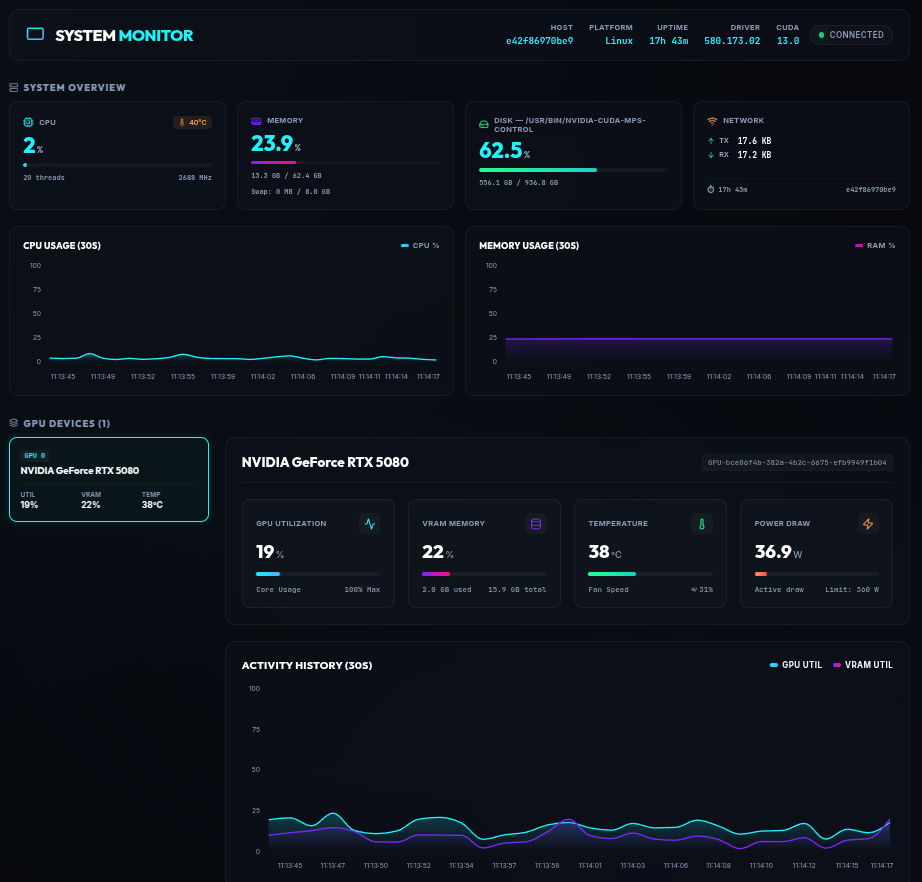

# System Monitor

A sleek, modern, glassmorphic real-time system monitoring dashboard.
Built with **Next.js (React/TypeScript)** for the frontend, **FastAPI (Python)** for the backend telemetry stream over WebSockets, and fully containerized with **Docker Compose**.



---

## Features
- **System Overview**: Real-time CPU usage, temperature, load average, RAM usage/swap, disk usage per partition, and network I/O — all updated every second.
- **GPU Monitoring**: Core utilization, VRAM, temperature, fan speed, power draw, and active CUDA/Graphics processes.
- **Real device detection**: Only devices that are actually detected are shown. NVIDIA GPUs (NVML), Apple GPUs (macOS `system_profiler`), and AMD/Intel/Qualcomm GPUs (Linux sysfs) are reported by the backend; the browser also detects the host OS and GPU (WebGPU/WebGL).
- **Cross-platform**: Works on macOS, Linux, and Windows hosts. The dashboard shows the real host OS (detected from the browser), not the container's OS.
- **Rolling Time-series Charts**: 30-second history graphs for CPU, memory, GPU utilization, and VRAM usage.
- **Multi-GPU support**: Automatically detects all NVIDIA GPUs and renders summary switcher cards in the sidebar.
- **Active Process Monitor**: Lists all CUDA/Graphics processes utilizing the active GPU with interactive search filtering and column sorting.
- **Rich Dark-mode UI**: Sleek glassmorphic panels, glowing neon highlights (color-coded warning states), and animated charts.
- **No fake data by default**: Nothing is fabricated. If no GPU is detected the GPU section is hidden entirely. Simulated telemetry is only available when explicitly enabled with `MOCK_GPU=true` (demo mode, clearly labeled in the UI).

---

## Quick Start (Docker Compose)

### 1. Launch the Application
In the project root, run:
```bash
docker compose up --build
```
- **Frontend Dashboard**: [http://localhost:3000](http://localhost:3000)
- **Backend API**: [http://localhost:8000](http://localhost:8000)
- **API Health Check**: [http://localhost:8000/api/health](http://localhost:8000/api/health)

The compose file does **not** reserve NVIDIA devices by default, so it runs out-of-the-box on machines with or without a GPU.

> **Linux + NVIDIA GPU telemetry (optional)**: To pass real NVIDIA GPUs into the container, install the [NVIDIA Container Toolkit](https://docs.nvidia.com/datacenter/cloud-native/container-toolkit/latest/install-guide.html) and uncomment the `deploy.resources.reservations.devices` block for the `backend` service in `docker-compose.yml`. The backend then reports live NVML telemetry (utilization, VRAM, temperature, power, processes).

---

## Environment Variables

All configuration lives in `.env` in the project root (copy the template with `cp .env.example .env` if it does not exist yet). Only `MOCK_GPU` matters for mock mode; the rest have sensible defaults.

| Variable | Default | Description |
| --- | --- | --- |
| `MOCK_GPU` | `false` | Set to `true` to force simulated GPU telemetry (no NVIDIA GPU required). |
| `BACKEND_PORT` | `8000` | Host port exposed for the FastAPI backend. |
| `FRONTEND_PORT` | `3000` | Host port exposed for the Next.js frontend. |
| `NEXT_PUBLIC_WS_URL` | *(empty)* | WebSocket URL for telemetry. If empty, the frontend connects to the current browser host on port `8000`. Example: `ws://192.168.1.100:8000/ws`. |

---

## How device detection works

| Source | Platform | What it reports |
| --- | --- | --- |
| Backend (NVML) | Linux/macOS/Windows, native or container | NVIDIA GPUs with live telemetry (utilization, VRAM, temperature, fan, power, processes, driver/CUDA versions) |
| Backend (`system_profiler` + `ioreg`) | macOS, native run only | Apple GPUs (e.g. Apple M1 Pro) with core count, Metal version, and live utilization/GPU memory stats (IORegistry, no sudo) |
| Backend (sysfs DRM) | Linux, native or container | AMD / Intel / Qualcomm GPUs |
| Browser (WebGPU/WebGL) | Any host | Real host OS (macOS/Windows/Linux/...) and GPU the browser sees |

Display rules:
- **NVIDIA GPU detected** → NVIDIA device info (driver, CUDA, live telemetry) is shown.
- **NVIDIA GPU not detected** → nothing NVIDIA-related is shown.
- **Apple GPU detected** → Apple device info with MPS compute backend is shown; on macOS native runs it also shows live GPU utilization and GPU memory (from IORegistry).
- **No GPU detected at all** → the GPU section is hidden.

---

## Mock / Demo Mode (optional)

Simulated telemetry is **disabled by default**. To preview the dashboard with fake data (two virtual GPUs: RTX 4090 and H100), set in `.env`:

```ini
MOCK_GPU=true
```

Then restart:
```bash
docker compose up -d
```

Mock data is always flagged with a **MOCK DATA** badge in the UI, so it is never mistaken for real hardware.

---

## Local Development (No Docker)

### Backend (Python FastAPI)
1. Navigate to `/backend`
2. Install requirements:
   ```bash
   pip install -r requirements.txt
   ```
3. Run the API:
   ```bash
   python main.py
   ```

### Frontend (Next.js)
1. Navigate to `/frontend`
2. Install Node packages:
   ```bash
   npm install
   ```
3. Start the dev server:
   ```bash
   npm run dev
   ```
